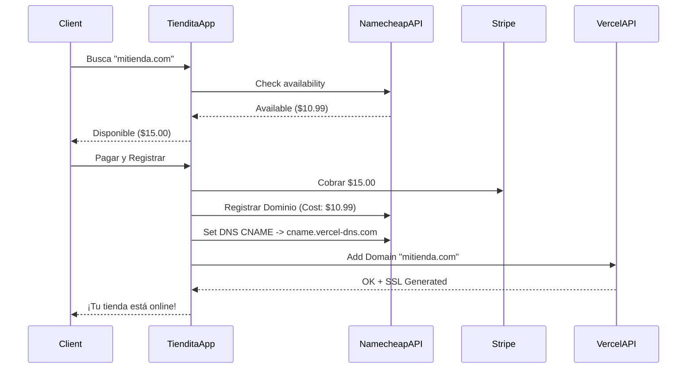

# 🌐 Estrategia de Dominios y Venta

## 1. Integración de Dominios Personalizados

Para que tus clientes usen su propio dominio (ej: `www.su-marca.com`) en lugar de `su-marca.tiendita.app`:

### Opción A: Vercel Free Tier (Manual / Semi-automático)
Vercel permite hasta **50 dominios personalizados** por proyecto en el plan Hobby (Gratis).
- **Proceso:**
  1. El cliente compra su dominio (donde sea).
  2. Configura un CNAME apuntando a `cname.vercel-dns.com`.
  3. Vos (como admin) agregás el dominio en tu Dashboard de Vercel > Settings > Domains.
  4. **Limitación:** Tenés que agregarlos manualmente o usar la API de Vercel (pero automatizar esto suele requerir planes Pro para escalar a miles).

### Opción B: Vercel Pro (Automático)
Si escalás a cientos de clientes, el plan Pro permite usar la **Vercel Domains API** para agregar dominios programáticamente desde tu backend cuando el cliente lo solicita.

---

## 2. Vender Dominios en tu Plataforma (Reseller)

Podés integrar la compra de dominios directamente en el panel "Mothership" o en el onboarding de la tienda.

### ¿Cómo funciona?
1. Usamos una API de Reseller (Revendedor).
2. El cliente busca `mitiendaexito.com` en tu app.
3. Tu backend consulta la API del proveedor.
4. Si está disponible, le cobrás al cliente (ej: $15 USD).
5. Tu backend compra el dominio por $10 USD (tu ganancia: $5 USD).
6. Tu backend configura los DNS automáticamente para apuntar a tu infraestructura.

### Proveedores Recomendados (Developer Friendly)

| Proveedor | API | Precio Base (.com) | Notas |
|-----------|-----|--------------------|-------|
| **Namecheap** | ✅ Excelente | ~$10 USD | Requiere depósito previo. Muy buena doc. |
| **ResellerClub** | ✅ Robusta | ~$11 USD | Estándar de la industria para hosting. |
| **GoDaddy API** | ✅ Limitada | Variado | A veces complejo de integrar para resellers. |
| **OpenProvider** | ✅ Moderno | Precios Wholesale | Modelo de membresía para mejores precios. |

### Diagrama de Flujo

## Recomendación para MVP
No te compliques integrando la venta de dominios **ahora**.
1. Dejá que los clientes compren su dominio en Namecheap/GoDaddy.
2. Dales una guía simple: "Poné este CNAME en tu panel".
3. Agregalo vos manualmente en Vercel.
4. Cuando tengas 50 clientes, pasate a Vercel Pro y automatizá todo con la API.
